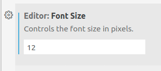
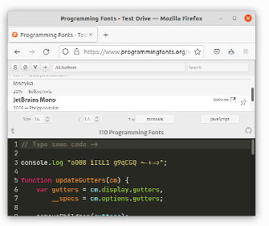

# Appearance

## Font size / display size




You can adjust the font size and the interface zoom independently.

I tend to keep the editor font size (`editor.fontSize`) at `12` and adjust the zoom with the 
menu command `View / Appearance / Zoom in or out` depending on the screen I use.

(font)=
## Font



Pick your own on https://www.programmingfonts.org. 

Fira Code / Hack / JetBrains Mono / Monaco / Source Code Pro / Ubuntu Mono are good options.

I like https://www.jetbrains.com/lp/mono/, with the options:

```json
    "editor.fontFamily": "JetBrains Mono",
    "editor.fontWeight": 300,
    "editor.fontLigatures": true,
```

(title_bar)=
## Compact title bar on Linux


Useful on small screens, i.e. laptops. The setting is:

```json
    "window.titleBarStyle": "custom"
```

Disable if it causes trouble with mouse cursor rendering when display scaling is enabled.

(multiple_monitors)=
## Multiple monitors

Use of multiple VS Code windows is a mess, see:

https://stackoverflow.com/questions/47260995/visual-studio-code-tabs-editors-of-the-same-project-in-multiple-screens

It's possible to open several copies of VS Code on the same project, but one should use the extra windows only to edit files.

I personally use a single screen for VS Code.
